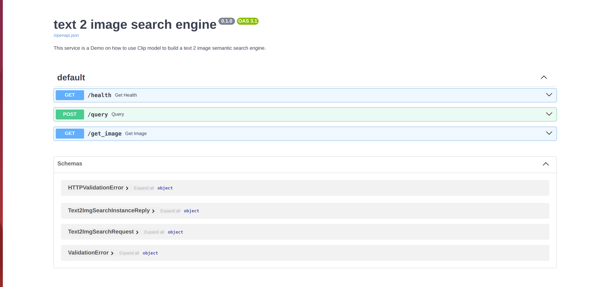

# Text2Img Semantic Search
In this repo it is implemented the code for a semantic search engine which given a text query,
it returns the metadata of top-k most similar images stored in a QDrant DB. Clip model is used
to extract the embeddings for both images and texts.
## 1. Installation Guide
To run this semantic search application you need to install QDrant, the development conda environment, and
the API required packages.

### 1.1 Installing Qdrant
```
docker pull qdrant/qdrant
docker run -d -p 6333:6333  -v $(pwd)/data/qdrant:/qdrant/storage  qdrant/qdrant
```
### 1.2 Installing conda environment
```
conda create -n clip python 3.10
conda activate clip
pip install -e .
```
### 1.3 Installing API requirements
In the __clip__ conda enviroment, you need to install the API requirements too. You can do so by applying the
following command
```
pip install -r api_requirements.txt
```

### 1.4 Running the Service:
Before running the service, you need to import the data in the QDrant. You can easily do so by executing the following
command
```commandline
python3 scripts/import_data.py
```
This will create the _coco_captions_ collection. Then, you are ready to start the service by typing the following bash
command
```commandline
sh run
```

## 2. Dataset
In this PoC, _lmms-lab/COCO-Caption_(dataset card in Huggingface Hub) is used as input dataset which will be indexed in the QDrant DB.
In detail, in the _img2textsemengine/dataset/create_dataset.py_ module it is implemented a function which
samples some records from the dataset. Then, from this sample images and captions we will extract the embeddings
to be stored in the QDrant. By executing the following command, anyone can create a sample:
~~~
python3 scripts/execute_create_dataset.py
~~~
As you can see, for this PoC, we sampled only 100 records.
## 3. Code Structure
### 3.1 Folders
The following folders are used in this repository:
* __config__: Define the configurations to run the application and to import the data in QDrant.
* __dataset__: The folder to store the sample data
* __data__: A folder to be created when starting the Qdrant for first time. It is the volume that stores the Qdrant data 
in a local path.
* __img2textsemengine__: Implement the code for creating the sample data, the code to import it in the Qdrant and the 
code for the FastAPI service.
  * _utils_: Implement the code to load configurations from a YAML file
  * _dataset_: Implement the code to sample from the original dataset.
  * _vector_db_: In this module, they are implemented two classes related to QDrant utilities. The classes are:
    * __Importer__ which is responsible to import the data in the Qdrant. In detail, it stores both the image and text _clip_ 
embedding in a specific collection. Also, it stores as a payload both the answers/captions for each image and the image 
url too. The captions/answers will be used to evaluate the accuracy of the model.
    * __Searcher__ which is responsible for querying the Qdrant to retrieve the top-k most similar objects against the 
user query
  *  _api_: Here it is implemented the code for the FastAPI service. In the following bullet points, I 
explain each module
     * __api_cfg__: A folder that implements utilities that handles the gunicorn and the fastAPI.
     * __ __init__ __.py: load the Searcher object and create the lifespan function which will be called when
initializing the FastAPI app
     * __main__: the module that is responsible for the FastAPI service. Here, it is loaded all the routes implemented in
the corresponding module and add a prometheus middleware. You can have a look at the services prometheus metrics in the 
"/metrics" route.
     * __request__: Implements the request schemas of the API.
     * __response__: Implements the response schemas of the API.
     * __config__: Implements the config parameters of the searcher object in a pydantic object.
     * __routes__: Implements the routes of the API. In the next subsection, it will be explained.
### 3.2 Routes
The routes of the API are the following:
* __health__: Returns "OK" if the service is up and running
* __query__: It is a request which returns the image url and the image captions of the most similar images in the DB 
against the user's query. We call asynchronously the _query_ function of the _Searcher_ object to avoid blocking requests
in case the service receives plenty of requests.
* __get_image__: It displays the images of a given url.
#### 3.2.1 Swagger
You can have a look at the swagger/OpenAPI documentation of the service in the 0.0.0.0:5000/docs endpoint or in the
following image

### 3.3 Files in root path
There are some files in the root path that are useful for running the whole service. These are:
* __app.properties__: the properties of the gunicorn.
* __run__: It is responsible for starting the fastAPI service.

## 4. EDA
### 4.1 EDA Notebook
In the __notebooks/EDA.ipynb__ file, you can view a brief EDA of the dataset.
## 5. Evaluation
### 5.1 Evaluation metrics
Some evaluation metrics for information retrieval systems like this semantic search engine are:
* __Mean Reciprocal Rank (MRR)__ is a ranking quality metric. It considers the position of the first relevant item in the ranked list.
You can calculate MRR as the mean of Reciprocal Ranks across all users or queries. 
A Reciprocal Rank is the inverse of the position of the first relevant item. If the first relevant item is in position 2, the reciprocal rank is 1/2. 
* __Normalized Discounted Cumulative Gain (NDCG)__ is a ranking quality metric. It compares rankings to an ideal order where all relevant items are at the top of the list.
NDCG at K is determined by dividing the Discounted Cumulative Gain (DCG) by the ideal DCG representing a perfect ranking. 
DCG measures the total item relevance in a list with a discount that helps address the diminishing value of items further down the list.
* __Recall at K__ measures the proportion of correctly identified relevant items in the top K recommendations out of the total number of relevant items in the dataset. In simpler terms, it indicates how many of the relevant items you could successfully find.
* __Precision at K__ is the ratio of correctly identified relevant items within the total recommended items inside the K-long list. Simply put, it shows how many recommended or retrieved items are genuinely relevant.

### 5.2 Evaluation Notebook
For more information about evaluating this semantic search engine please have a look at the
__notebooks/Evaluation.ipynb__ notebook.


## 6. Future work
- [ ] Labelling the images, to be in place to compute more metrics
- [ ] Add Unit tests
- [ ] Fine-tune the model in the dataset
- [ ] Dockerize the application
- [ ] Adjust the images so all of them will have the same dimensions.
- [ ] Add nginx proxy server
- [ ] Now, it supports inserting data only at once. It will be updated
so anyone can add data after the initialization of the DB.
- [ ] Convert to ONNX the CLIP model, to avoid utilize torch package. It will boost the inference time of the model,
and it will decrease the size in GBs of the service.
- [ ] A more thorough evaluation notebook.